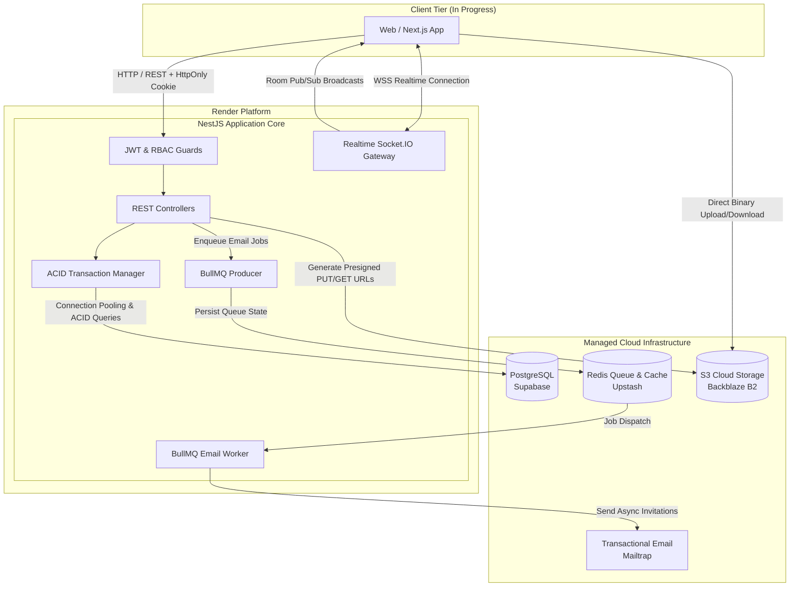

<div align="center">

# 🚀 Task Manager API

**A high-performance, real-time, multi-tenant task and workspace management backend built with NestJS, PostgreSQL, Redis, and WebSockets.**

[](https://nestjs.com/)
[](https://www.typescriptlang.org/)
[](https://supabase.com/)
[](https://upstash.com/)
[](https://socket.io/)
[](https://bullmq.io/)
[](https://render.com/)

<p align="center">
  <a href="#-system-architecture">Architecture</a> •
  <a href="#-cloud-infrastructure">Cloud Stack</a> •
  <a href="#-key-features">Features</a> •
  <a href="#-database-schema">Database Schema</a> •
  <a href="#-api-documentation">API Reference</a> •
  <a href="#-real-time-events">WebSockets</a> •
  <a href="#-getting-started">Getting Started</a>
</p>

</div>

---

## 📌 Overview

**Task Manager API** is an enterprise-ready backend designed for team collaboration, multi-tenant workspace isolation, project tracking, real-time updates, and cloud file management.

Built with architectural rigor, the API leverages **raw parameterized PostgreSQL queries** over heavy ORMs for predictable performance, executes **atomic multi-table transactions**, isolates real-time socket communication into workspace rooms, manages asynchronous task queues with **BullMQ + Redis**, and offloads media assets directly to **S3-compatible cloud storage** via presigned URLs.

> 💡 **Frontend Status:** The frontend web application is currently **in active development** (React / Next.js). The backend is fully CORS-enabled and configured for secure cross-origin HTTP-only cookies and WebSocket handshakes.

---

## 🏗️ System Architecture



---

## ☁️ Cloud Infrastructure & Services

| Component | Provider / Technology | Description |
| :--- | :--- | :--- |
| **Backend Compute** | [Render](https://render.com) | Containerized Node.js/NestJS production deployment with automated CI/CD. |
| **Relational Database** | [Supabase](https://supabase.com) (PostgreSQL) | Managed PostgreSQL instance with connection pooling, custom indexes, and foreign key cascades. |
| **Distributed Queue / Cache** | [Upstash](https://upstash.com) (Serverless Redis) | Cloud-hosted Redis backing **BullMQ** for reliable, non-blocking background email jobs. |
| **Object Storage** | [Backblaze B2](https://www.backblaze.com/b2) (S3 API) | S3-compatible cloud bucket handling secure presigned direct-to-cloud uploads & downloads. |
| **Email Delivery** | [Mailtrap](https://mailtrap.io) | Transactional email provider for workspace invitations with retry mechanisms. |

---

## ✨ Key Technical Highlights & Features

### 1. 🔐 Enterprise Authentication & Token Rotation
- **Dual-Token Flow:** Issues short-lived Access Tokens (JWT, 15m) and secure, HTTP-Only Refresh Tokens (1d).
- **Refresh Token Rotation (RTR):** Generates unique token families (`family_id`).
- **Reuse Detection:** If a previously used refresh token is presented, the entire token family is instantly revoked to prevent token replay attacks.
- **Bcrypt Hashing:** Passwords and stored refresh tokens are securely hashed with bcrypt (salt rounds: 10).

### 2. 🏢 Multi-Tenant Workspaces & Role-Based Access Control (RBAC)
- **Hierarchical Roles:** Granular permission system supporting `owner`, `admin`, and `member`.
- **Custom Decorators & Guards:** `@RequireRole('owner', 'admin')` and `WorkspaceGuard` validate membership and permissions before requests reach services.
- **Ownership Transfer Protocol:** Automated owner succession to active admins or selected members upon owner departure.

### 3. ⚡ High-Performance Raw SQL with ACID Transactions
- **Zero ORM Overhead:** Employs `@types/pg` pool queries with strict parameterized inputs preventing SQL injection.
- **Transaction Safety:** Custom `TransactionService` abstracts `BEGIN`, `COMMIT`, and `ROLLBACK` handling with seamless client connection leasing.

### 4. 🔄 Real-Time Collaboration (WebSockets)
- **Socket.IO Gateway:** Namespaced under `/realtime`.
- **Authenticated Handshakes:** Validates JWT access tokens at connection time.
- **Room-Based Isolation:** Users join designated `workspace:{id}` rooms to receive live updates (`task.created`, `task.updated`, `task.deleted`, `project.*`, `workspace.*`) without broadcast leaks.

### 5. 📬 Background Job Queues (BullMQ)
- **Non-Blocking Architecture:** Workspace invitation dispatches are delegated to asynchronous worker queues via Upstash Redis.
- **Reliability:** Built-in automatic retries (up to 5 attempts) with configurable delays and failure handling.

### 6. 📦 Presigned S3 Direct Uploads (Backblaze B2)
- **Zero Server Bandwidth Consumption:** Clients request presigned `PUT` URLs; large binary files stream directly from the client to cloud storage.
- **Server Verification:** Two-phase upload with `/confirm` endpoint validating S3 `HeadObject` metadata before persisting records into PostgreSQL.

---

## 🗄️ Database Schema

The database is built on PostgreSQL with strict relational integrity, composite unique indexes, and cascade deletion rules.

```
       ┌──────────────┐
       │    users     │◀──────────────┐
       └──────┬───────┘               │
              │ 1                     │
              ▼ *                     │
       ┌──────────────┐         ┌─────┴────────┐
       │refresh_tokens│         │ invitations  │
       └──────────────┘         └──────────────┘
              │                       ▲
              │ 1                     │
              ▼ *                     │
       ┌──────────────┐               │
       │  workspaces  ├───────────────┤
       └──────┬───────┘               │
              │ 1                     │
              ├───────────────────────┤
              ▼ *                     ▼ *
       ┌──────────────┐         ┌──────────────┐
       │   members    │         │   projects   │
       └──────────────┘         └──────┬───────┘
                                       │ 1
                                       ▼ *
                                ┌──────────────┐
                                │    tasks     │
                                └──────┬───────┘
                                       │ 1
                                       ▼ *
                                ┌──────────────┐
                                │    files     │
                                └──────────────┘
```

> 📄 The full executable DDL script with all constraints, partial indexes, and triggers is available in [`schema.sql`](./schema.sql).

---

## 📚 API Reference

All protected endpoints require an `Authorization: Bearer <access_token>` header, unless marked **[Public]**.

### 🔑 Authentication Module (`/auth`)

| Method | Endpoint | Access | Description |
| :--- | :--- | :--- | :--- |
| `POST` | `/auth/register` | Public | Register a new user account; returns access token & sets refresh cookie |
| `POST` | `/auth/login` | Public | Authenticate user credentials; returns access token & sets refresh cookie |
| `POST` | `/auth/refresh` | Public | Exchange refresh token cookie for a newly rotated token pair |
| `POST` | `/auth/logout` | Public | Revokes refresh token and clears client cookies |

---

### 🏢 Workspaces Module (`/workspaces`)

| Method | Endpoint | RBAC Role | Description |
| :--- | :--- | :--- | :--- |
| `POST` | `/workspaces` | Authenticated | Create a new workspace (creator automatically becomes `owner`) |
| `GET` | `/workspaces` | Authenticated | Paginated & searchable list of user's workspaces (`page`, `search`, `sortBy`, `sortOrder`) |
| `PUT` | `/workspaces/:workspaceId` | `owner`, `admin` | Update workspace name |
| `DELETE` | `/workspaces/:workspaceId` | `owner` | Delete a workspace and cascade delete all sub-resources |

---

### 👥 Workspace Members Module (`/workspaces/:workspaceId/members`)

| Method | Endpoint | RBAC Role | Description |
| :--- | :--- | :--- | :--- |
| `PUT` | `/workspaces/:workspaceId/members/:memberId/role` | `owner` | Promote/demote member role (`admin`, `member`) or transfer ownership (`owner`) |
| `DELETE` | `/workspaces/:workspaceId/members/:memberId` | Dynamic | Remove a member or leave a workspace (with automatic owner succession) |

---

### 📁 Projects Module (`/workspaces/:workspaceId/projects`)

| Method | Endpoint | RBAC Role | Description |
| :--- | :--- | :--- | :--- |
| `POST` | `/workspaces/:workspaceId/projects` | `owner`, `admin` | Create a new project inside a workspace |
| `GET` | `/workspaces/:workspaceId/projects` | Workspace Member | Paginated list of projects with sorting and search filters |
| `PUT` | `/workspaces/:workspaceId/projects/:projectId` | `owner`, `admin` | Update project name |
| `DELETE` | `/workspaces/:workspaceId/projects/:projectId` | `owner`, `admin` | Delete project and associated tasks |

---

### 📋 Tasks Module (`/workspaces/:workspaceId/projects/:projectId/tasks`)

| Method | Endpoint | RBAC Role | Description |
| :--- | :--- | :--- | :--- |
| `POST` | `.../tasks` | `owner`, `admin`, `member` | Create a new task (priority, status, assignee, instructions) |
| `GET` | `.../tasks` | Workspace Member | Filterable tasks (`status`, `priority`, `assignedTo`, `search`, `sortBy`, pagination) |
| `PUT` | `.../tasks/:taskId` | Dynamic | Update task. Admins/owners can update any task; members only their assigned tasks |
| `DELETE` | `.../tasks/:taskId` | `owner`, `admin` | Delete task and its cloud file attachments |

---

### ✉️ Invitations Module

| Method | Endpoint | Access | Description |
| :--- | :--- | :--- | :--- |
| `POST` | `/workspaces/:workspaceId/invitations` | `owner`, `admin` | Create pending invitation & dispatch transactional email via BullMQ |
| `POST` | `/workspaces/invitations/accept` | Authenticated | Accept workspace invite via token; grants membership |
| `POST` | `/workspaces/invitations/decline` | Public | Decline invitation via token |

---

### ☁️ Cloud File Storage Module

| Method | Endpoint | RBAC Role | Description |
| :--- | :--- | :--- | :--- |
| `POST` | `.../tasks/:taskId/store` | `owner`, `admin` | Request a signed presigned S3 upload URL for direct cloud upload |
| `POST` | `.../tasks/:taskId/files/:fileId/confirm` | `owner`, `admin` | Confirm uploaded file metadata with S3 HeadObject and persist file record |
| `GET` | `.../tasks/:taskId/files/:fileId` | Workspace Member | Generate a secure, time-limited presigned S3 download URL |

---

## ⚡ Real-Time Events (WebSocket)

Connect to the Socket.IO server at `/realtime` namespace with an `auth: { token: "<access_token>" }` payload.

### Subscribing to Rooms
```javascript
// Client-side subscription
socket.emit('workspace.join', { workspaceId: 1 });

socket.on('workspace.joined', (data) => {
  console.log(`Joined workspace room: ${data.workspaceId}`);
});
```

### Broadcast Events
| Event Name | Description | Payload Data |
| :--- | :--- | :--- |
| `task.created` | New task created in workspace | `{ task: TaskObject, createdAt: Date }` |
| `task.updated` | Task modified (status, assignment, details) | `{ task: TaskObject }` |
| `task.deleted` | Task removed from project | `{ taskId: number }` |
| `project.created` | New project added to workspace | `{ project: ProjectObject, createdAt: Date }` |
| `project.updated` | Project renamed | `{ project: ProjectObject, updatedAt: Date }` |
| `project.deleted` | Project deleted | `{ projectId: number }` |
| `workspace.created`| Workspace initialized | `{ workspace: WorkspaceObject, createdAt: Date }` |
| `workspace.updated`| Workspace metadata updated | `{ workspace: WorkspaceObject, updatedAt: Date }` |
| `workspace.deleted`| Workspace removed | `{ workspaceId: number }` |

---

## ⚙️ Environment Configuration

Create a `.env` file in the root directory modeled after the template below:

```env
# Server
PORT=3000
NODE_ENV=development
FRONTEND_URL=http://localhost:3000

# PostgreSQL (Supabase)
POSTGRES_HOST=db.<project-ref>.supabase.co
POSTGRES_PORT=5432
POSTGRES_USER=postgres
POSTGRES_PASSWORD=your_supabase_password
POSTGRES_DB=postgres

# Redis & Message Queue (Upstash)
REDIS_PASSWORD=your_upstash_redis_password

# JWT Secrets & Expiry
ACCESS_TOKEN_SECRET=your_jwt_access_secret_key
REFRESH_TOKEN_SECRET=your_jwt_refresh_secret_key
INVITATION_TOKEN_SECRET=your_jwt_invitation_secret_key
ACCESS_TOKEN_EXPIRES_IN=15m
REFRESH_TOKEN_EXPIRES_IN=1d
INVITATION_TOKEN_EXPIRES_IN=7d

# Mailtrap (Transactional Email)
API_TOKEN=your_mailtrap_api_token
MAILTRAP_TEST_INBOX_ID=your_inbox_id
MAIL_FROM_ADDRESS=noreply@taskmanager.com

# S3 Object Storage (Backblaze B2)
B2_Key_ID=your_backblaze_key_id
B2_ApplicationKey=your_backblaze_application_key
B2_Key_Name=your_key_name
B2_Endpoint=https://s3.<region>.backblazeb2.com
B2_Region=eu-central
B2_BUCKET_NAME=Task-Files
```

---

## 🛠️ Getting Started

### Prerequisites
- **Node.js**: `v20.x` or `v22.x` (LTS)
- **npm**: `v10+`
- **PostgreSQL**: (e.g. Supabase account or local PostgreSQL instance)
- **Redis**: (e.g. Upstash account or local Redis server)

### Installation

1. **Clone the repository:**
   ```bash
   git clone https://github.com/Amen974/Task_Manager_API.git
   cd Task_Manager_API
   ```

2. **Install dependencies:**
   ```bash
   npm install
   ```

3. **Initialize the Database:**
   Run the queries from `schema.sql` inside your PostgreSQL database console or Supabase SQL Editor:
   ```bash
   psql -h <POSTGRES_HOST> -U <POSTGRES_USER> -d <POSTGRES_DB> -f schema.sql
   ```

4. **Start the Development Server:**
   ```bash
   npm run start:dev
   ```
   The API will be live at `http://localhost:3000`.

---

## 🧪 Testing & Code Quality

```bash
# Run unit tests
npm test

# Run tests in watch mode
npm run test:watch

# Run test coverage report
npm run test:cov

# Run end-to-end (e2e) tests
npm run test:e2e

# Run linter
npm run lint

# Format code with Prettier
npm run format
```

---

## 🐳 Docker Deployment

The application includes a production-ready `Dockerfile` and `compose.yaml`:

```bash
# Build and run using Docker Compose
docker compose up --build -d
```

---

## 👨‍💻 Author

- **Amen** - *Backend & Distributed Systems Engineer* - [GitHub](https://github.com/Amen974)

---

<div align="center">
  <sub>Built with clean code principles, scalable architecture, and strict security standards.</sub>
</div>